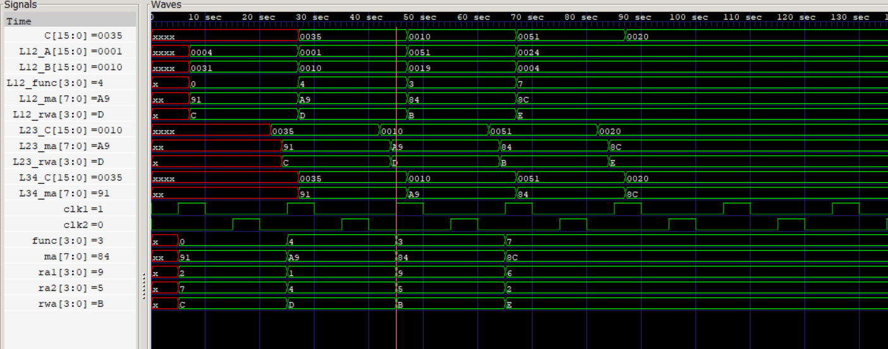

This is an example of a simple 4 Stage Pipeline.  
Two Phase clock, 16x16 RegBank and 256x16 Memory is used in this project.  
The Register Bank has 2 read ports and 1 write port.  

Stage 1 -> Two Register Reads  
Stage 2 -> Perform Operation based on 4bit OpCode  
Stage 3 -> Write Result back to Register Bank  
Stage 4 -> Write Result to Memeory  

GTKWave Output

